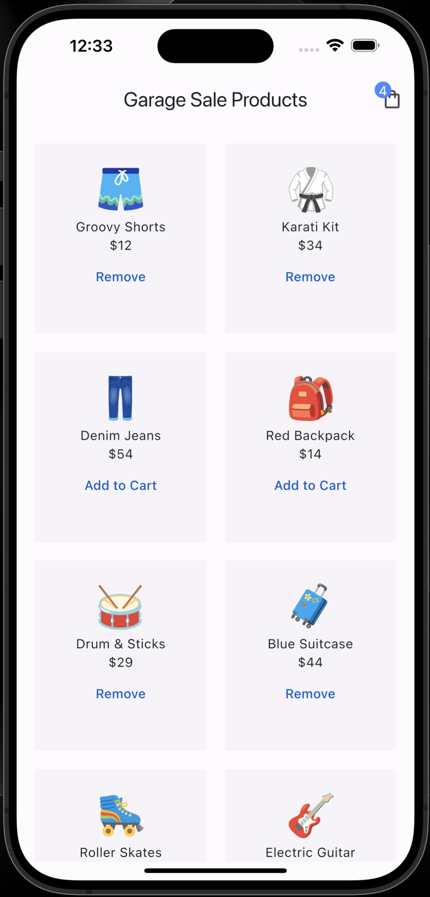
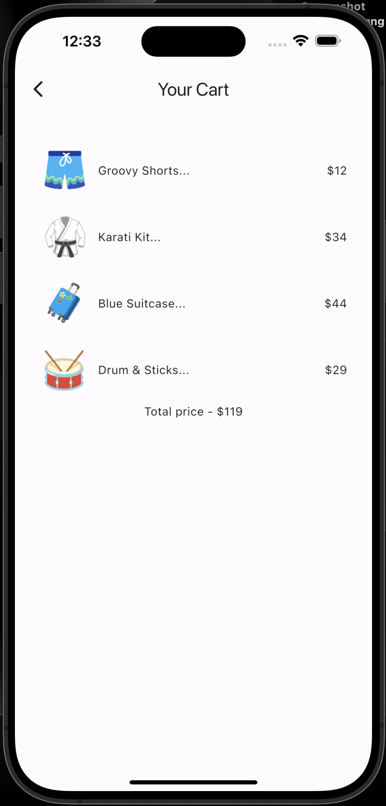

# Cart

The Flutter application displays a list of products on the home screen and enables users to add or remove products from a shopping cart. It also keeps track of the total price of the selected products in the cart, providing users with a clear view of their total spending.

## App Overview

    
    

